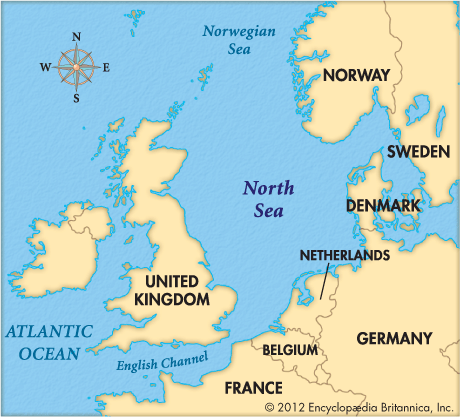

```{=html}
<style>
body {
  text-align: justify;
}
</style>
```

```{r message=FALSE, warning=FALSE, include=FALSE}
library(gstat)
library(sp)
library(ggplot2)
library(mapview)
library(leaflet)
library(leafsync)
library(gridExtra)
library(knitr)
library(car)
library(sf)
library(reshape)
```

# **1.Introdução**

O banco de dados utilizado neste estudo contém informações sobre concentrações de PCB138 em pontos localizados na Plataforma Continental Holandesa, que é a parte holandesa do mar do norte na Europa. Cada observação inclui as coordenadas x e y e os valores de concentração do composto, registrados em diferentes locais dessa área. <br> PCB138 é um dos muitos congêneres de *bifenilos policlorados* (PCBs), que são compostos químicos sintéticos amplamente utilizados no passado em indústrias devido à sua estabilidade térmica, química e elétrica. <br> A partir desses dados dois modelos geoestatísticos foram propropostos: um sem covariável e outro com duas covariáveis descritas nas seções a seguir.

<div style="text-align: center;">



</div>

\

<div style="text-align: center;">


</div>


\

\

# **2.Visualização do Banco**

Nosso banco é composto por 216 observações e as 7 seguintes variáveis:

<div style="font-size: 20px;">

-   **year**: ano da medição
-   **x**: coordenada x
-   **y**: coordenada y
-   **coast**: distância até à costa da Holanda, em quilômetros.
-   **depth**: profundidade da água do mar em metros.
-   **PCB138**: PCB138, medido na fração de sedimentos menor que 63 micrômetros.
-   **yf**: ano da medição como fator.

</div> 

```{r}
data("pcb")
data("ncp.grid")
```

```{r}
kable(head(pcb))
```

```{r}
str(pcb)
```

```{r}
df <- pcb
coordinates(df) <- ~x+y 
class(df)
```

```{r message=FALSE, warning=FALSE, include=FALSE}
df <- df[-zerodist(df)[,1],] 
```

Visualização dos pontos:

```{r fig.align='center', fig.height=6, fig.width=6, message=FALSE, warning=FALSE}

ggplot(data.frame(df))+
  geom_point(aes(x=x, y=y, color= PCB138))
```

Grid onde os valores serão preditos:

```{r fig.align='center', fig.height=6, fig.width=6, message=FALSE, warning=FALSE}
df_grid <- ncp.grid
gridded(df_grid) <- ~x + y # transforma na classe sp
proj4string(df_grid) <- CRS("+init=epsg:28992") # indicar o tipo de projeção para o mapview
proj4string(df) <- CRS("+init=epsg:28992")

ggplot(data.frame(df_grid))+
  geom_point(aes(x=x, y=y), color = "grey", alpha=0.2)+
  geom_point(aes(x=x, y=y), alpha = 0.5, data = data.frame(df))
```

Vizualização uilizando LEAF:

```{r fig.align='center', fig.height=6, fig.width=7, message=FALSE, warning=FALSE}
# coordenadas em sistema UTM Zone 31
ncp_sf <- st_as_sf(ncp.grid, coords = c("x", "y"), crs = 32631) 


ncp_sf <- st_transform(ncp_sf, crs = 4326)


leaflet(data = ncp_sf) %>%
  addTiles() %>%  
  addCircleMarkers(
    color = ~colorNumeric("viridis", depth)(depth),  
    popup = ~paste("Profundidade:", depth),                
    radius = 5                                        
  ) %>%
  addLegend(
    "bottomright", 
    pal = colorNumeric("viridis", ncp_sf$depth), 
    values = ncp_sf$depth,
    title = "depth",
    opacity = 1
  )
```

```{r fig.align='center', fig.height=6, fig.width=7, message=FALSE, warning=FALSE}
# coordenadas em sistema UTM Zone 31
pcb_sf <- st_as_sf(pcb, coords = c("x", "y"), crs = 32631) 


pcb_sf <- st_transform(pcb_sf, crs = 4326)


leaflet(data = pcb_sf) %>%
  addTiles() %>%  
  addCircleMarkers(
    color = ~colorNumeric("viridis", PCB138)(PCB138),  
    popup = ~paste("PCB138:", PCB138),                
    radius = 5                                        
  ) %>%
  addLegend(
    "bottomright", 
    pal = colorNumeric("viridis", pcb_sf$PCB138), 
    values = pcb_sf$PCB138,
    title = "PCB138",
    opacity = 1
  )
```

\

\

# **3. Krigagem**

Utilizaremos como variável resposta a concentração de PCB-138 no mar. <br> Plotando o histograma da variável:

```{r, fig.align='center', fig.width=6, fig.height=6}
hist(df$PCB138, xlab = "PCB138 (µg/kg)", ylab = "Frequência", main = "Histograma - PCB138")
```

O histograma apresenta forte assimetria. Aplcaremos o log para tentarmos modelar assumindo a normalidade da variável resposta.


```{r, fig.align='center', fig.width=6, fig.height=6}
hist(log(df$PCB138), xlab = "Log de PCB138 (µg/kg)", ylab = "Frequência", main = "Histograma - Log(PCB138)")
```

Com a transformação, pelo histograma, assumiremos normalidade.

\

Estimação do variograma:

```{r echo=TRUE, message=FALSE, warning=FALSE}
variograma <- variogram(log(PCB138) ~ 1, locations = ~x + y, data = data.frame(df))

kable(variograma)  
```

```{r}
plot(variograma)
```

```{r fig.align='center', fig.height=6, fig.width=6}
#Variograma Gaussiano
fit.gau <- fit.variogram(variograma, vgm(1.0, "Gau", 75000))
plot(variograma, fit.gau)
```


Suavizando o Efeito Pepita (Nugget) no variograma e plotando alguns modelos:


```{r fig.align='center', fig.height=6, fig.width=6}
fit.sph <- fit.variogram(variograma, vgm(1.0, "Sph", 60000, nugget = 0.1)) 
fit.gau <- fit.variogram(variograma, vgm(1.0, "Gau", 75000, nugget = 0.1))
fit.exp <- fit.variogram(variograma, vgm(1.0, "Exp", 50000, 0.1))
par(mfrow = c(1, 3)) # 1 linha e 3 colunas


plot(variograma, fit.sph, main = "Variograma Esférico")
plot(variograma, fit.gau, main = "Variograma Gaussiano")
plot(variograma, fit.exp, main = "Variograma Exponencial")

```

```{r message=FALSE, warning=FALSE, include=FALSE}
# Exemplo de dados (substitua 'df' pelos seus dados)
df2<-data.frame(df)
coordinates(df2) <- ~x + y
variograma <- variogram(log(PCB138) ~ 1, data = df2, cutoff = 80000, width = 5000)
kable(variograma)
```

```{r message=FALSE, warning=FALSE}
fit.sph <- fit.variogram(variograma, model = vgm(psill = 1.0, model = "Sph", range = 60000, nugget = 0.1))
#fit.sph
plot(variograma, model = fit.sph, main = "Variograma Esférico")
fit.gau <- fit.variogram(variograma, model = vgm(psill = 1.0, model = "Gau", range = 75000, nugget = 0.1))
plot(variograma, model = fit.gau, main = "Variograma Gaussiano")
```


## **3.1 Krigagem Ordinária**

Modelo assumindo média desconhecida e constante. 

```{r message=FALSE, warning=FALSE, include=FALSE}
variograma <- variogram(log(PCB138) ~ 1, locations = ~x + y, data = data.frame(df))
fit.gau1 <- fit.variogram(variograma, vgm(1.0, "Gau", 75000, 0.05))
```


```{r}
dados_krig_ordinaria <- krige(log(PCB138) ~ 1, df, df_grid, model = fit.gau1)
```

```{r}
names(dados_krig_ordinaria)
```

```{r}
class(dados_krig_ordinaria)
```

```{r fig.align='center', fig.height=6, fig.width=6}
p1pred <- spplot(dados_krig_ordinaria["var1.pred"], main = "Krigagem Ordinária - Valores Preditos: Log (PCB-138)")
p1pred
```

\

```{r fig.align='center', fig.height=6, fig.width=6}
p1var <- spplot(dados_krig_ordinaria["var1.var"], main = "Krigagem Ordinária - Variancia da Predição")
p1var
```

\

```{r fig.align='center', fig.height=6, fig.width=6}
plot_media_ordinaria <- ggplot(data.frame(dados_krig_ordinaria)) +
  geom_tile(aes(x = x, y = y, fill = var1.pred)) +
  scale_fill_gradient(low = "blue", high = "yellow") +
  geom_point(aes(x = x, y = y), alpha = 0.5, data = data.frame(df)) +
  labs(fill = "Log - PCB183.Pred", title = "Valores Preditos e Observados") +
  theme(plot.title = element_text(hjust = 0.5))

plot_media_ordinaria
```

\

```{r fig.align='center', fig.height=6, fig.width=6}
plot_variancia_ordinaria <- ggplot(data.frame(dados_krig_ordinaria)) +
  geom_tile(aes(x = x, y = y, fill = var1.var)) +
  scale_fill_gradient(low = "blue", high = "yellow") +
  geom_point(aes(x = x, y = y), alpha = 0.5, data = data.frame(df)) +
  labs(fill = "Log - PCB138.Var", title = "Variância Predita e Observada") +
  theme(plot.title = element_text(hjust = 0.5)) # Centraliza o título

plot_variancia_ordinaria
```

\

```{r fig.align='center', fig.height=7,fig.width=12}
grid.arrange(plot_media_ordinaria, plot_variancia_ordinaria, ncol=2)
```

\

\

## **3.2 Krigagem Universal**

Modelo assumindo média variável, como uma função do espaço. 

```{r}
summary(lm(log(PCB138) ~ depth + coast, data = df))
```

As variáveis "depth" e "coast" foram significativas ao nível alfa de **5%**.


```{r fig.align='center', fig.height=6, fig.width=6}
ggplot(data.frame(df))+
  geom_point(aes(x=depth, y=log(PCB138)))
```

```{r fig.align='center', fig.height=6, fig.width=6}
ggplot(data.frame(df))+
  geom_point(aes(x=coast, y=log(PCB138)))
```

\

Variograma Considerando as Covariáveis:

```{r}
variograma_com_covariavel <- variogram(log(PCB138) ~ depth + coast, data = df)
plot(variograma_com_covariavel)
```

```{r}
ajuste_esf_variograma_com_covariavel = fit.variogram(variograma_com_covariavel, vgm(0.6, "Gau", 75000, 0.5))

plot(variograma_com_covariavel, ajuste_esf_variograma_com_covariavel)
```


```{r message=FALSE, warning=FALSE}
dados_krigagem_universal <- krige(log(PCB138) ~ depth + coast, df, df_grid, model = ajuste_esf_variograma_com_covariavel)
```

```{r fig.align='center', fig.height=6, fig.width=6}
p2pred <- spplot(dados_krigagem_universal["var1.pred"], main = "Krigagem Universal - Valores Preditos: Log (PCB-138)")
p2pred
```

```{r}
p2var <- spplot(dados_krigagem_universal["var1.var"], main = "Krigagem Universal - Variancia da Predição")
p2var
```


```{r fig.align='center', fig.height=6, fig.width=6, include=FALSE}
#####
plot_pred_krigagem_universal <- ggplot(data.frame(dados_krigagem_universal)) +
  geom_tile(aes(x = x, y = y, fill = var1.pred)) +
  scale_fill_gradient(low = "blue", high = "yellow") +
  geom_point(aes(x = x, y = y), alpha = 0.5, data = data.frame(df)) +
  labs(fill = "Log - PCB183.Pred", title = "Valores Preditos e Observados") +
  theme(plot.title = element_text(hjust = 0.5))

plot_pred_krigagem_universal
```

```{r fig.align='center', fig.height=6, fig.width=6, include=FALSE}
#####
plot_var_krigagem_universal <- ggplot(data.frame(dados_krigagem_universal)) +
  geom_tile(aes(x = x, y = y, fill = var1.var)) +
  scale_fill_gradient(low = "blue", high = "yellow") +
  geom_point(aes(x = x, y = y), alpha = 0.5, data = data.frame(df)) +
  labs(fill = "Log - PCB138.Var", title = "Variância Predita e Observada") +
  theme(plot.title = element_text(hjust = 0.5))

plot_var_krigagem_universal
```

\

```{r fig.align='center', fig.height=7,fig.width=12}
grid.arrange(plot_media_ordinaria, plot_variancia_ordinaria, ncol=2)
```

\

Comparação dos dois modelos:

```{r fig.align='center', fig.height=7,fig.width=12}
grid.arrange(p1pred, p2pred, ncol=2)
```

```{r fig.align='center', fig.height=7,fig.width=12}
grid.arrange(p1var, p2var, ncol=2)
```

\

\

## **3.3 Qualidade de Predição**

```{r fig.align='center', fig.height=7,fig.width=12}
erro_krigagem_universal <- krige.cv(log(PCB138) ~ depth + coast, df, ajuste_esf_variograma_com_covariavel)
mse_krigagem_universal <- round(sqrt(mean(erro_krigagem_universal$residual^2)), 7)
mse_krigagem_universal
```

```{r fig.align='center', fig.height=7,fig.width=12}
erro_krigagem_ordinaria <- krige.cv(log(PCB138) ~ 1, df, fit.gau)
mse_krigagem_ordinaria <- round(sqrt(mean(erro_krigagem_ordinaria$residual^2)), 7)
mse_krigagem_ordinaria
```

O modelo sem covariáveis apresenta um MSE um pouco maior se comparado ao modelo considerando as variáveis "depth" e "coast". 


```{r fig.align='center', fig.height=7,fig.width=12}
valores_predidos_reais = data.frame(predito_universal=c(erro_krigagem_universal$var1.pred), predito_ordinaria =c(erro_krigagem_ordinaria$var1.pred), reais = c(log(df$PCB138)))

ggplot(valores_predidos_reais) +
  geom_point(aes(x=reais, y=predito_universal)) +
  geom_point(aes(x=reais, y=predito_ordinaria), col="red", alpha=0.4) +
  geom_smooth(aes(x=reais, y=predito_universal, color="Universal"), method="lm", se=FALSE) +  # Linha de tendência para predito_universal
  geom_smooth(aes(x=reais, y=predito_ordinaria, color="Ordinaria"), method="lm", se=FALSE) +  # Linha de tendência para predito_ordinaria
  ggtitle("Diferença entre os valores preditos e reais") + 
  theme(plot.title = element_text(hjust = 0.5)) +
  scale_color_manual(name = "Tipo de Previsão", values = c("Universal" = "blue", "Ordinaria" = "red"))

```

